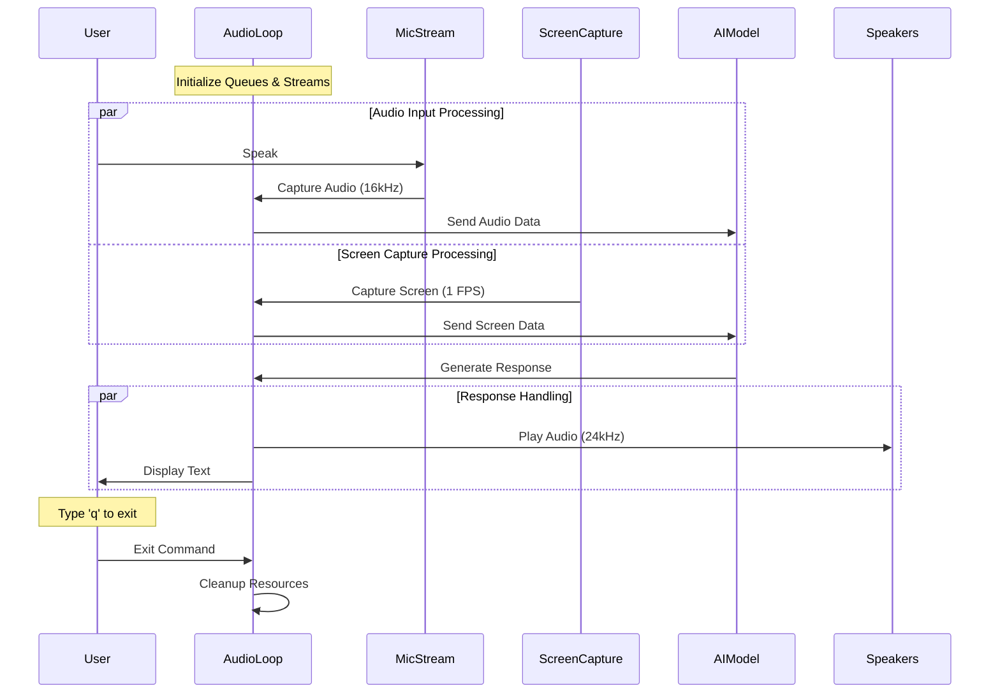

# Voice　AI　Chatbot with Screen Sharing for Mac OS

## Get started with the Gemini API
This project requires a Gemini API key. Additionally, please be sure to use earphones or headphones to prevent audio loop errors.

1. Go to [Google AI Studio](https://aistudio.google.com/).
2. Log in with your Google account.
3. [Create](https://aistudio.google.com/app/apikey) an API key.

## Features

- **Voice Interaction:** Communicate with the AI using voice commands.
- **Screen Sharing:** The AI can view and analyze your screen in real-time.
- **Real-Time AI Responses:** Receive immediate responses from the AI based on your interactions.
- **Environment Configuration:** Easily manage API keys and configurations using a `.env` file.

## Benefits

- **Hands-Free Operation:** Interact with the AI without the need for typing.
- **Enhanced Productivity:** Manage tasks and gather information efficiently through voice commands.
- **Visual Assistance:** The AI can assist by analyzing your screen content in real-time.

## Technical Details

- **Programming Language:** Python
- **Voice Processing:** Utilizes PyAudio for capturing and playing audio streams.
- **Screen Capture:** Uses MSS and Pillow for capturing and processing screen images.
- **AI Integration:** Integrates with Google's Generative AI (`genai`) for generating responses.
- **Environment Variables:** Managed using `python-dotenv`.

## Architecture

### System Architecture Diagram


### Component Breakdown

1. **AudioLoop (Main Controller)**
   - Manages all async tasks and data flow
   - Handles initialization and cleanup of audio streams
   - Coordinates communication between components
   - Queues: audio_in_queue, audio_out_queue, data_out_queue

2. **Audio Processing**
   - Input: Captures microphone audio at 16kHz sample rate
   - Output: Plays AI responses at 24kHz sample rate
   - Uses PyAudio for stream management
   - Implements overflow protection in debug mode

3. **Screen Capture**
   - Captures primary monitor screen every second
   - Processes images using Pillow
   - Resizes images to max 1024x1024
   - Converts to JPEG format for efficient transmission

4. **AI Model Integration**
   - Uses Gemini 2.0 Flash experimental model
   - Supports both audio and text responses
   - Handles real-time data streaming
   - Processes both voice and screen inputs simultaneously

5. **Task Management**
   - Uses asyncio for concurrent operations
   - Implements TaskGroup for parallel task execution
   - Handles graceful shutdown and resource cleanup
   - Manages exception handling across all tasks

## Setup Instructions

### Setting Up Environment Variables

1. Replace your_gemini_api_key with your Gemini API key in the `.env` file:

   ```
   GEMINI_API_KEY=your_gemini_api_key
   ```

### Installing Dependencies

1. Install the required libraries:

   ```bash
   pip install -r requirements.txt
   ```

### Running the Chatbot

1. Execute the `main.py` script to start the voice chatbot.

2. Interact with the AI using your voice. Type "q" in the terminal to quit the application.

## Troubleshooting

- **Microphone Issues:** Ensure that your microphone is properly connected and configured.
- **API Key Errors:** Verify that the `GEMINI_API_KEY` is correctly set in the `.env` file.
- **Permission Errors:** Run the script with appropriate permissions if you encounter access issues.
- **Use Earphones:** Please use earphones while using this AI. Using speakers may cause the AI's audio to be picked up by the microphone, leading the AI to mistakenly recognize its own responses as user input, resulting in a loop error.

## License

This project is licensed under the MIT License.
